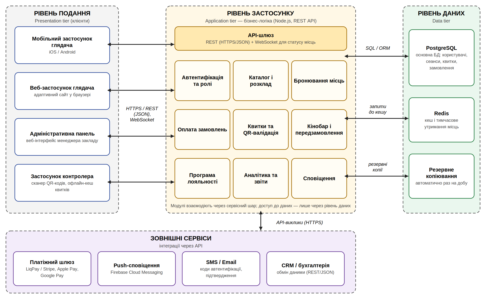
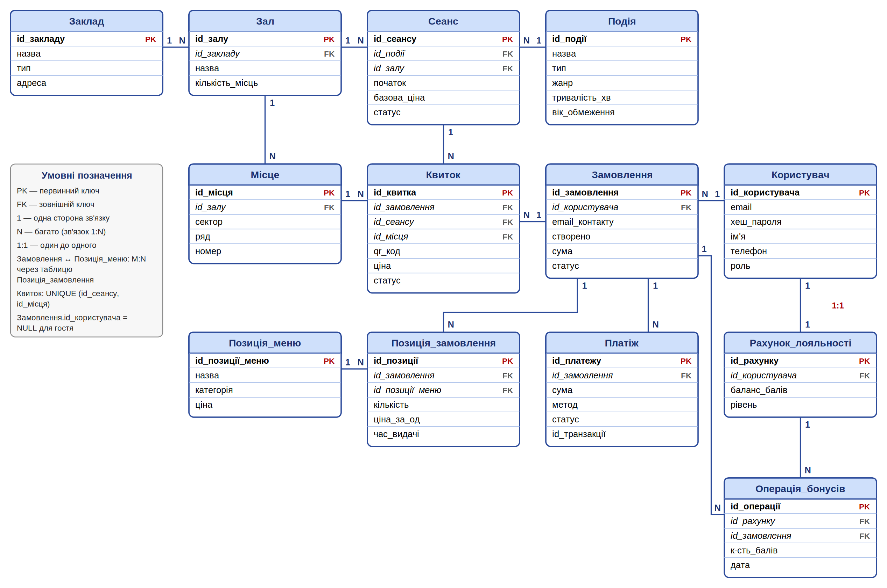
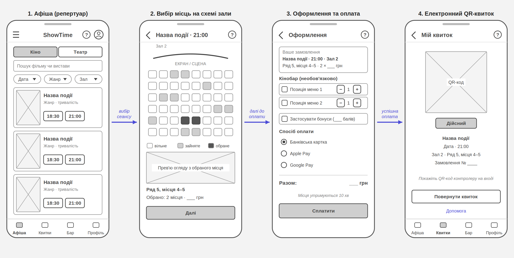
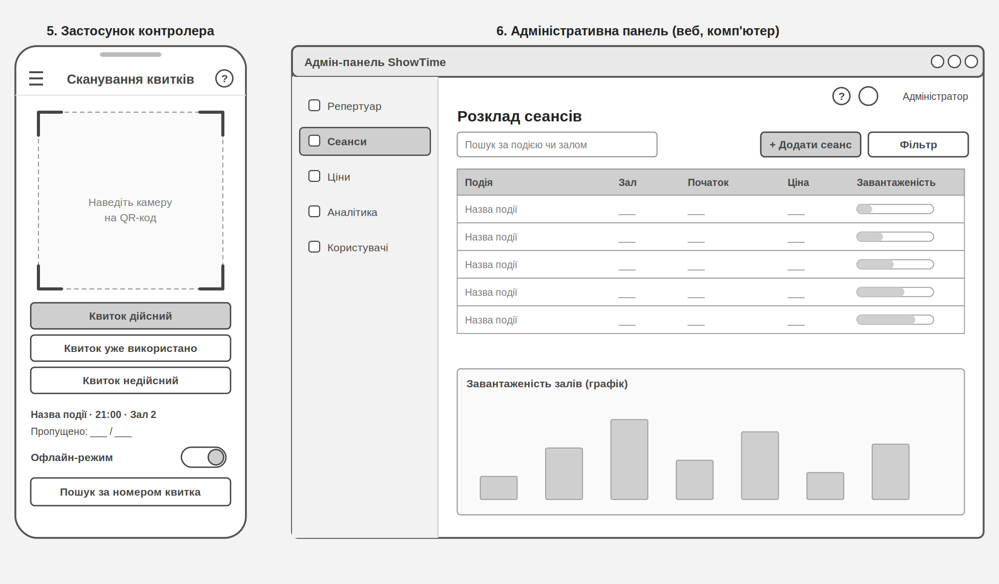
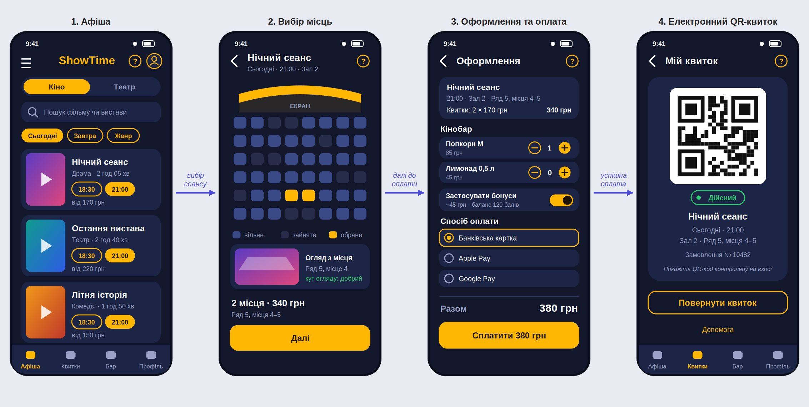

# ТСПП — Лабораторна робота № 3: проєктування системи

Варіант № 10: застосунок для театру/кінотеатру. Матеріали архітектурного, ER- та UX/UI-проєктування.

### Архітектурний стиль і архітектурна діаграма

Для системи обрано трирівневу (3-tier) клієнт-серверну архітектуру з модульним рівнем застосунку: вона приховує базу даних від клієнтів, масштабується горизонтально та підходить для поетапної розробки. На діаграмі показано рівень подання (мобільний і веб-застосунок, адмін-панель, застосунок контролера), рівень застосунку (API-шлюз і модулі бронювання, оплати, квитків, кінобару, лояльності) та рівень даних (PostgreSQL, Redis), а також зовнішні сервіси. Стрілки позначають напрямки взаємодії: HTTPS/REST і WebSocket між клієнтами та сервером, SQL/ORM до бази.

### ER-діаграма

ER-діаграма відображає базу даних системи з тринадцяти сутностей: заклад, зал, місце, подія, сеанс, квиток, замовлення, платіж, користувач, позиція меню, позиція замовлення, рахунок лояльності та операція бонусів. Позначено первинні (PK) й зовнішні (FK) ключі та зв'язки 1:1, 1:N і M:N; зв'язок M:N між замовленням і позицією меню реалізовано таблицею «Позиція_замовлення». Унікальність пари «сеанс — місце» в таблиці «Квиток» не дозволяє продати одне місце двічі.

### Каркас інтерфейсу (Wireframe)

Каркас показує структуру екранів без кольорів і графіки: афіша, вибір місць на схемі зали з прев'ю огляду, оформлення замовлення та електронний QR-квиток. Стрілки відображають послідовність переходів у сценарії покупки квитка. Окремий файл містить каркаси екранів персоналу: застосунку контролера та адміністративної панелі.

### Макет інтерфейсу (Mockup)

Макет — це статичний вигляд тих самих чотирьох екранів у темній темі застосунку «ShowTime» з бурштиновим акцентом. Він містить кольори, типографіку, іконки, схему зали з обраними місцями, форму замовлення з оплатою та QR-код. Макет узгоджено з вимогами розділу 2.1 SRS: нижня навігація та кнопка довідки на кожному екрані.

